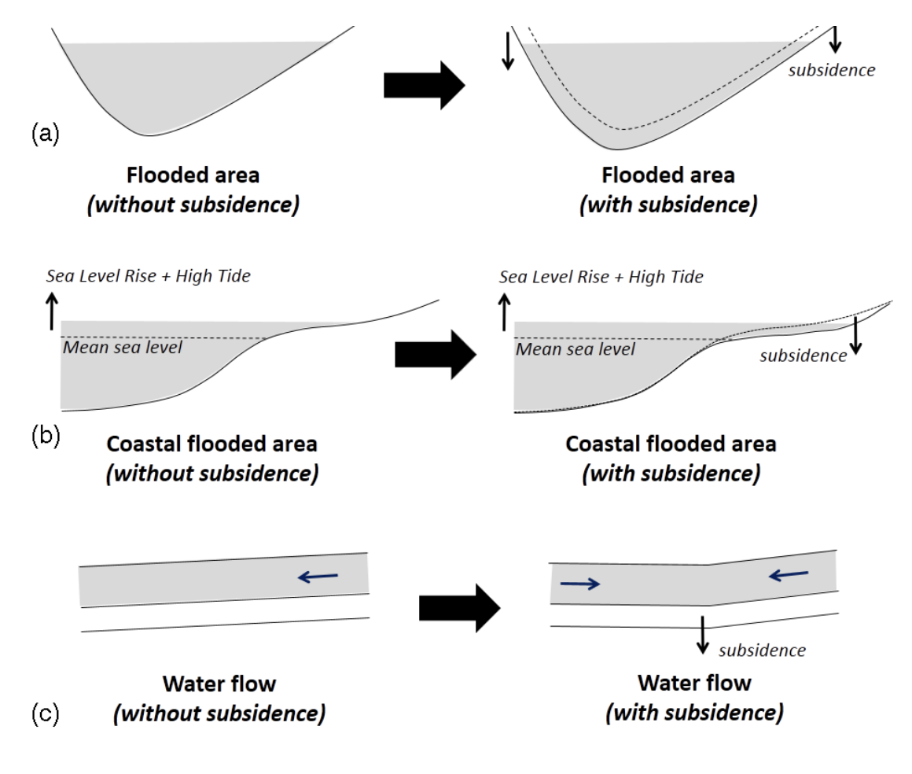
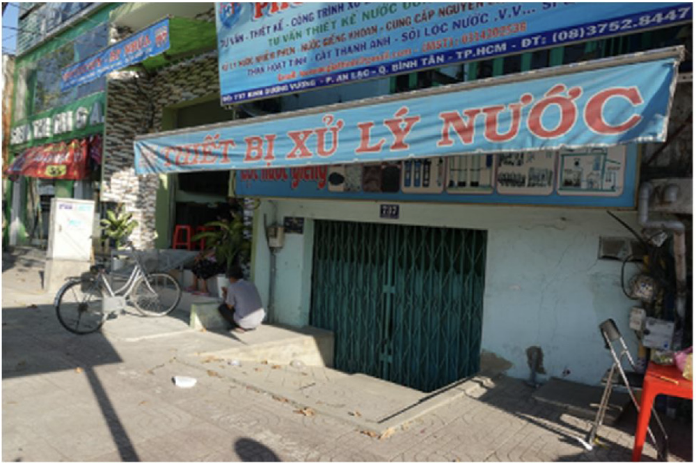
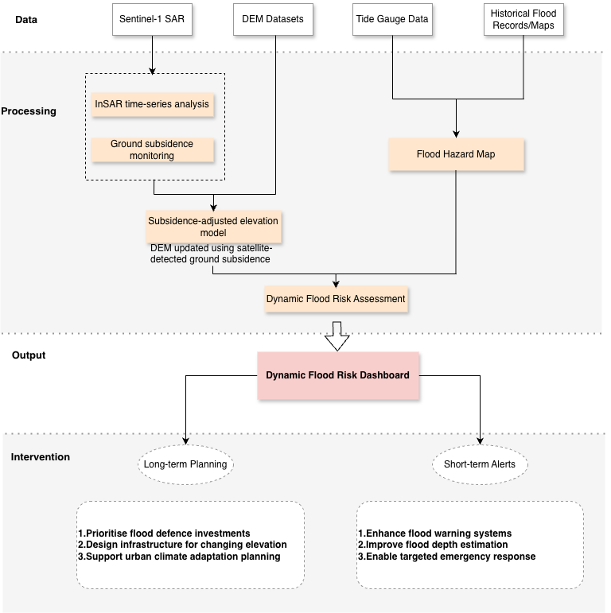
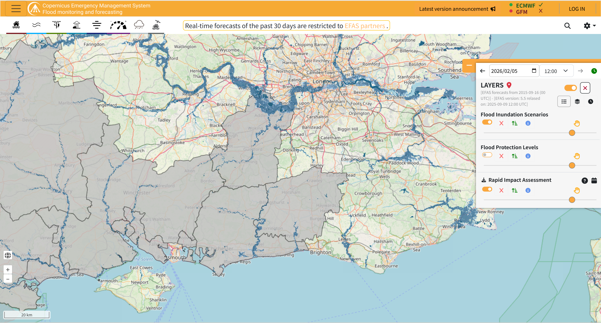
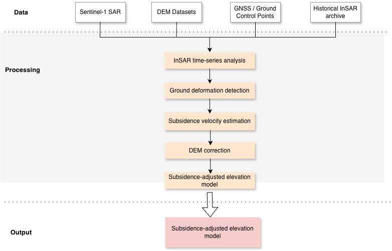
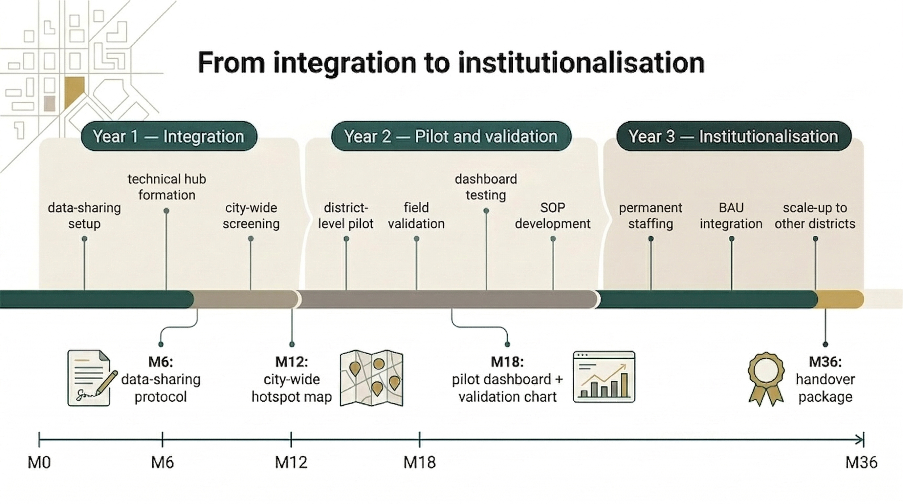

```{r setup, include=FALSE}
options(htmltools.dir.version = FALSE)
```

```{r xaringan-all, echo=FALSE, warning=FALSE}
library(xaringan)
library(xaringanExtra)
library(knitr)

xaringanExtra::use_search(show_icon = TRUE, auto_search	=FALSE)
xaringanExtra::use_tile_view()
xaringanExtra::use_fit_screen()
xaringanExtra::use_clipboard()
xaringanExtra::use_extra_styles(
  hover_code_line = TRUE,         
  mute_unhighlighted_code = TRUE  
)
xaringanExtra::use_panelset()
```

```{r xaringan-themer, include=FALSE, warning=FALSE}
library(xaringanthemer)
style_mono_accent(
  base_color = "#1c5253",
  header_font_google = google_font("Josefin Sans"),
  text_font_google   = google_font("Montserrat", "300", "300i"),
  code_font_google   = google_font("Fira Mono")
)
```

class: inverse, center, middle

# Problem Definition

---

## Background
#### HCMC faces **the compounding hazards of land subsidence and flooding**.

.pull-left[
### Land Subsidence
- Most populous city in Vietnam + Rapid urbanization

- Massive groundwater extraction 

- Compacting the soft delta soil

- **One of the fastest-sinking cities in the world**

>HCMC has sunk **~1 meter** since 1990, with current rates at **2-5 cm/year** (JICA), peaking at **7-8 cm/year** in commercial hubs [(SGGP, 2025)](https://en.sggp.org.vn/reasons-behind-hcmcs-accelerated-land-subsidence-revealed-post121758.html).
]

.pull-right[
### Flooding
- 65% of the city is less than 1.5 m above mean sea level (Vachaud et al., 2019)

- Sea level rising

- Extreme monsoon rains

- **One of the most vulnerable cities to flooding**, especially for SLR–induced flooding (IPCC, 2019)

]

---

### The Vicious Cycle
.pull-left[
- Sinking ground + Sea-level rise = Relative Sea-Level Rise (RSLR)

- Sinking terrain turns neighborhoods into permanent water sinks and breaks underground drainage pipes (Abidin et al., 2015).

- **Results:** Floods become deeper, last longer, and are geometrically harder to drain.

- Solving the flood crisis requires managing both the **water** and the **sinking ground** (Navarro-Hernández et al., 2023).
]

.pull-right[
```{r echo=FALSE, out.width='90%', fig.align='center'}

```
<p style="font-size: 12px; color: black; margin-top: 0px; text-align: center;">
  Impacts of land subsidence on flooding phenomena. Source: Abidin et al., (2015)
</p>
]

---

## Problem Statement

.pull-left[
### Technical Blind Spot

The current Flood Risk Management Project relies on **static elevation models**, ignoring dynamic ground sinking.

 - Early warning system failure
 - Wasted infrastructure

### Institutional Silos

- SCFC manages flooding (surface water).
- DONRE manages land subsidence (groundwater).
- **No shared dynamic platform** exists to calculate compounding risks.
]

.pull-right[
### Socio-Economic Impact

- Localized fixes (e.g., raising streets) ignore city-wide impacts (Cao et al., 2021).
- Displacing floodwater directly into less-protected, poorer communities.
- **Economic damage hits the poorest.**

```{r echo=FALSE, out.width='65%', fig.align='center'}

```
<p style="font-size: 12px; color: black; margin-top: 0px; text-align: center;">
  Raised road covers the entrance of a house and turns it into cave. 
  
  Source: Cao et al., (2021)
</p>
]
---

## Project Objective

### Key Objectives
The project monitors areas in Ho Chi Minh City at risk from both **land subsidence** and **severe flooding**. 
It integrates satellite data streams for subsidence and flood monitoring into a **unified dashboard** for city disaster management.

### Strategic Resource Allocation
Guide flood protection investments and mitigation efforts to the **most vulnerable coastal and riverine areas** along the Saigon River.

**Shift from reactive repairs → proactive prevention**

### Local Capacity Development
Train city engineers to operate the system **independently**, reducing reliance on external consultants.
**Pilot**: Self-sustaining technical unit in **Binh Tan District**
---

## Compliance with development agendas
### Sendai Framework Compliance

**Investing in Resilience**  
- Shifts from reactive reconstruction to **pre-emptive maintenance**  
- EO data guides infrastructure investments  
- Enables **real-time crisis decisions** for engineers  

### SDG 11.5 Alignment

**"Reduce disaster adverse effects"**  
- **Decreases** deaths, affected people, economic losses  
- **Protects** vulnerable populations (Binh Tan District)  
- Targets **floods + land subsidence** threats  

---

## Benefits of Resolving Subsidence & Flooding 

### Economic
- **High ROI:** Prevention investments deliver **2–10× returns**.  
- **Cost-Effective:** **Early action** is up to **5× cheaper** than post-disaster recovery.

### Social
- **Protects the Vulnerable:** **EO early warning** can cut impacts by **30–50%**.  
- **Builds Resilience:** **Risk maps** empower local planning in areas like **Binh Tan**.

### Capacity & Sustainability
- **Local Empowerment:** **Sendai-aligned EO training** reduces reliance on foreign experts.  
- **Self-Reliant Monitoring:** **InSAR skills** enable continuous, **low-cost tracking** of land change.

---
class: inverse, center, middle

# Project Approach

---

## Current Workflow

.pull-left[
### Flood management

- Historically led by **SCFC**
- A proposed WB project reflected the city’s dominant flood management logic
- Focus on:
  - rainfall monitoring
  - river / tidal water levels
  - drainage performance
- Main response:
  - early warning
  - sluice gates / embankments
  - drainage upgrades
]

.pull-right[
### Subsidence monitoring

- Managed by **DONRE**
- Focus on:
  - groundwater regulation
  - leveling networks
  - GPS points
  - groundwater records
- InSAR used mainly in research
- Monitoring remains partly fragmented and periodic
]

<p style="font-size: 12px; color: black; margin-top: 20px;">
Sources: World Bank (2016); Actuaries Institute (2021); Erban et al. (2014); Nguyen et al. (2015)
</p>

---

## Key Limitations

.pull-left[
### Flood management

- Strong **hydromet focus**
- Heavy reliance on **grey infrastructure**
- Limited integration of **subsidence dynamics**
]

.pull-right[
### Subsidence monitoring

- **Spatially sparse**
- **Temporally limited**
- Weak integration with flood risk management

### Result

- Risks are monitored separately
- Compound flood risk is underestimated
]

<p style="font-size: 12px; color: black; margin-top: 20px;">
Sources: Minderhoud et al. (2019); Nguyen et al. (2015)
</p>

---

## Data Sources

.pull-left[

### Earth Observation Data

- Sentinel-1 SAR imagery  
- InSAR time-series analysis  

###Terrain Data

- Digital Elevation Model (DEM)  
- Subsidence-adjusted elevation  

]

.pull-right[

###Hydrological Data

- Tide gauge data  
- Historical flood records  

###Data Compliance

- Open-access EO datasets  
- Local processing of sensitive data  
- Compliance with Vietnam regulations  

]

---

## Module 1: Dynamic Flood Risk Assessment

```{r echo=FALSE, out.width='50%', fig.align='center'}

```

---

## Reference: Global Flood Monitoring Platforms

```{r echo=FALSE, out.width='75%', fig.align='center'}

```

---

## Module 2: Dynamic Elevation Monitoring

```{r echo=FALSE, out.width='65%', fig.align='center'}

```

---

## Reference: Dynamic Subsidence Dashboard

```{r echo=FALSE, out.width='80%', fig.align='center'}
knitr::include_graphics('images/example2.png')
```

---
class: inverse, center, middle
 
#Project plan, risks and value for money
 
---

# What this proposal adds

.pull-left[
### Current situation
- Existing flood management systems already exist
- Digital flood operations are developing
- But land subsidence is not yet fully integrated into operational decisions
]

.pull-right[
### Our contribution
- We do **not** replace current systems
- We add a **subsidence-aware decision layer**
- This improves prioritisation, targeting, and long-term use
]

<br>

> **Message:** We strengthen the current system rather than starting from zero.

---

# A self-sustaining operational cycle

<div style="text-align: center;">

</div>

> **Message:** The pilot is selected through evidence, not assumed in advance.

---

# Who operates the system?

| Phase | Lead actor | Main role |
|---|---|---|
| City-wide screening | DONRE technical hub | EO processing and hotspot screening |
| Flood-risk review | SCFC | operational interpretation and prioritisation |
| Pilot delivery | Selected district + SCFC + technical hub | validation, dashboard use, SOP testing |
| Long-term use | Permanent HCMC unit | routine updates, maintenance, and scale-up |

<br>

> **Message:** City-wide prioritisation must be led at city level, not district level.

---

# From external support to internal operation

.pull-left[
### External role
- initial technical advice
- training support
- limited quality assurance
]

.pull-right[
### HCMC role
- routine processing
- data governance
- operational decisions
- long-term maintenance
]

<br>

<div style="font-size: 1.05em;">
By <strong>Year 3</strong>, the workflow should run without routine external support.
</div>

<br>

> **Message:** The goal is internal capability, not outsourced analysis.

---

# How the dashboard changes decisions

.panelset[
.panel[.panel-name[Short-term response]

### Short-term response
- update hotspot maps on a routine basis
- trigger targeted alerts when high-risk hotspots overlap with extreme rainfall or tide
- support rapid local response and field verification

]

.panel[.panel-name[Long-term planning]

### Long-term planning
- revise maintenance priorities
- inform district budgeting
- guide infrastructure investment
- support more defensible public spending

]

.panel[.panel-name[Why it matters]

### Why it matters
- the dashboard links monitoring to operational decisions
- it supports both emergency response and long-term planning
- it helps the city act earlier and target resources better

]
]

<br>

> **Message:** The dashboard matters because it changes decisions.

---

# 3-year implementation roadmap

<div style="text-align: center;">

</div>

---

# Budget, value for money, and risk

.panelset[
.panel[.panel-name[Budget]

### Budget

| Category | Budget | Strategic Value |
|---|---:|---|
| **Stage 1: Screening & System Setup** | **£175,000 (35%)** | Builds the data and processing foundation for city-wide hotspot identification. |
| **Stage 2: Technical Unit & Pilot Operations** | **£275,000 (55%)** | Funds training, pilot delivery, SOP development, and long-term in-house capability. |
| **Validation, Adaptation & Contingency** | **£50,000 (10%)** | Supports ground-truthing, workflow adjustment, and implementation flexibility. |
| **Total** | **£500,000** | **Strengthens existing flood operations and leaves lasting city capacity.** |

]

.panel[.panel-name[Key Risks]

### Key Risks
- <strong>Institutional silo</strong>  
  SCFC and DONRE may not coordinate effectively  
  → shared protocol, joint review points, clear ownership

- <strong>Data governance risk</strong>  
  data handling and hosting may create administrative delays  
  → local hosting, limited external dependence, phased rollout

- <strong>Staff turnover</strong>  
  trained staff may leave after the pilot  
  → Year 3 permanent unit, SOP package, retention pathway

- <strong>Technical uncertainty</strong>  
  subsidence outputs may need refinement in practice  
  → field validation, pilot testing, dashboard adjustment

]

.panel[.panel-name[Value for Money]

### Why this is worth funding

- strengthens <strong>existing</strong> flood operations rather than duplicating them

- improves how limited public spending is targeted

- reduces long-term dependence on external consultants

- leaves behind a trained in-house unit, shared workflow, and reusable dashboard

]
]

---

class: middle, center
# Conclusion

### Existing systems are developing, but subsidence is still not fully integrated.

### Our proposal strengthens current operations rather than replacing them.

<br>

**We make flood management more targeted, more operational, and more sustainable.**

---

# Reference

- Vachaud, G. et al. (2019) ‘Flood-related risks in Ho Chi Minh City and ways of mitigation’, Journal of Hydrology, 573, pp. 1021–1027. Available at: https://doi.org/10.1016/j.jhydrol.2018.02.044.

- Intergovernmental Panel on Climate Change (IPCC) (ed.) (2022) ‘Sea Level Rise and Implications for Low-Lying Islands, Coasts and Communities’, The Ocean and Cryosphere in a Changing Climate: Special Report of the Intergovernmental Panel on Climate Change. Cambridge: Cambridge University Press, pp. 321–446. Available at: https://doi.org/10.1017/9781009157964.006.

- Navarro-Hernández, M.I. et al. (2023) ‘Analysing the Impact of Land Subsidence on the Flooding Risk: Evaluation Through InSAR and Modelling’, Water Resources Management, 37(11), pp. 4363–4383. Available at: https://doi.org/10.1007/s11269-023-03561-6.

- Abidin, H.Z. et al. (2015) ‘On correlation between urban development, land subsidence and flooding phenomena in Jakarta’, Proceedings of IAHS. Changes in Flood Risk and Perception in Catchments and Cities - IAHS Symposium HS01, 26th General Assembly of the International Union of Geodesy and Geophysics, Prague, Czech Republic, 22 June&ndash;2 July 2015, Copernicus GmbH, pp. 15–20. Available at: https://doi.org/10.5194/piahs-370-15-2015.

- Cao, A. et al. (2021) ‘Future of Asian Deltaic Megacities under sea level rise and land subsidence: current adaptation pathways for Tokyo, Jakarta, Manila, and Ho Chi Minh City’, Current Opinion in Environmental Sustainability, 50, pp. 87–97. Available at: https://doi.org/10.1016/j.cosust.2021.02.010.

---

# Reference

- World Bank (2016) Ho Chi Minh City Flood Risk Management Project (P149696). Available at: https://projects.worldbank.org/en/projects-operations/project-detail/P149696 (Accessed: 9 March 2026).

- Actuaries Institute (2021) Floods in Vietnam: Will rising waters tame the rising dragon? 
Available at: https://www.actuaries.asn.au/research-analysis/floods-in-vietnam-will-rising-waters-tame-the-rising-dragon (Accessed: 9 March 2026).

- Erban, L., Gorelick, S.M. and Zebker, H.A. (2014) ‘Groundwater extraction, land subsidence, and sea-level rise in the Mekong Delta, Vietnam’, Environmental Research Letters, 9(8). Available at: https://iopscience.iop.org/article/10.1088/1748-9326/9/8/084010

- Nguyen, H.Q. et al. (2015) ‘Land subsidence monitoring in Ho Chi Minh City using Persistent Scatterer InSAR’, Remote Sensing, 7(7), pp. 8543–8564. Available at: https://www.mdpi.com/2072-4292/7/7/8543

- Minderhoud, P.S.J. et al. (2019) ‘Impacts of 25 years of groundwater extraction on subsidence in the Mekong Delta, Vietnam’, Scientific Reports, 9. Available at: https://doi.org/10.1088/1748-9326/AA7146.


